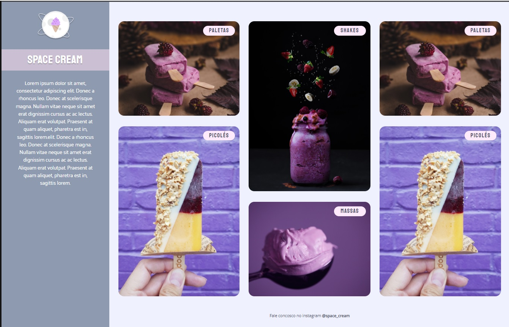

<h1 align="center"> Space Cream 🍨 </h1>

Projeto tem como objetivo masterizar/demonstrar qualidades técnicas no front-end.  

  <a href="#-tecnologias">Tecnologias</a>&nbsp;&nbsp;&nbsp;|&nbsp;&nbsp;&nbsp;
  <a href="#-projeto">Projeto</a>

  

 

## 🚀 Tecnologias

Esse projeto foi desenvolvido com as seguintes tecnologias:

- HTML e CSS
- Git e Github

## 💻 Projeto

Este projeto teve como objetivo criar uma página de sorvetes chamada Space Cream, para masterizar a utilização de layouts responsivos levando em consideração o conceito Mobile First, unidades de medidas flexíveis, animações e transições com CSS, Grid Layout e Media Queries.

 <h3 align="start"> ⚙️ Funcionalidades</h3>
 
- Ao carregar a tela: as imagens sobem enquanto os tipos de sorvete descem. 

- As principais diferenças entre as versões Desktop e Mobile: A versão Desktop apresenta imagens duplicadas e um rodapé que não estão disponíveis na versão Mobile.

- Ao manter o mouse sobre as imagens: da um breve zoom na imagem. 

- [Visite o projeto online](https://sabrinaduque.github.io/space-cream/)
